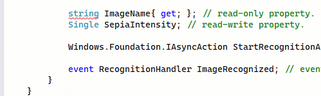
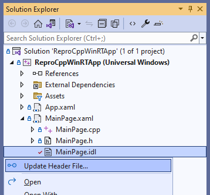
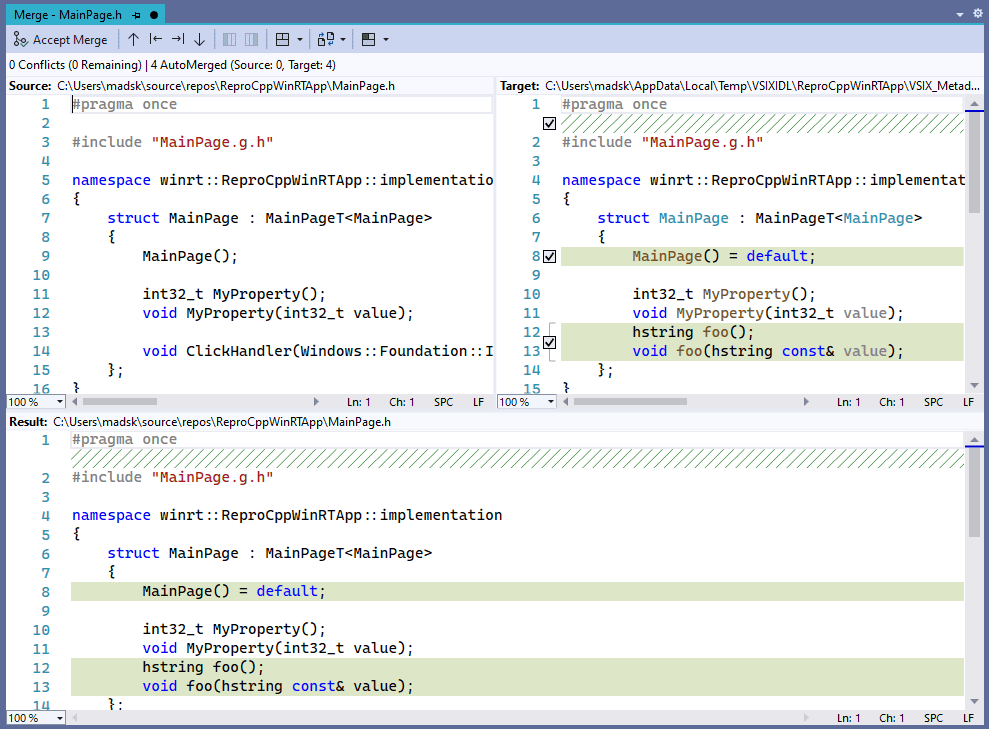

[marketplace]: https://marketplace.visualstudio.com/items?itemName=MadsKristensen.MIDL
[vsixgallery]: http://vsixgallery.com/extension/MIDL.148cb49f-0d60-482a-a9ca-800f2b6c579b/
[repo]:https://github.com/madskristensen/MIDL

# WinRT Tools for C++

Download this extension from the [Visual Studio Marketplace][marketplace]
or get the [CI build][vsixgallery].

--------------------------------------

Provides language support for IDL 3 and header generation based on WinMD transformations.

## Update header (.h) file
Right-click any .idl file to invoke the *Update Header File...* command.

Doing that will result in the generation of a WinMD file followed by header file generation by using **cppwinrt**. All of this takes place in a temp folder, so no artifacts will be added to your project.

Once the generation is done, a merge window pops up to let you merge the updates you need into your .h file.

Click **Accept Merge** in the upper-left corner moves the changes you selected into the .h file in your project.

## How can I help?
If you enjoy using the extension, please give it a ★★★★★ rating on the [Visual Studio Marketplace][marketplace].

Should you encounter bugs or if you have feature requests, head on over to the [GitHub repo][repo] to open an issue if one doesn't already exist.

Pull requests are also very welcome, since I can't always get around to fixing all bugs myself. This is a personal passion project, so my time is limited.

Another way to help out is to [sponsor me on GitHub](https://github.com/sponsors/madskristensen).